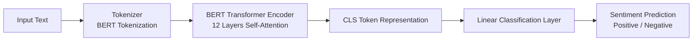
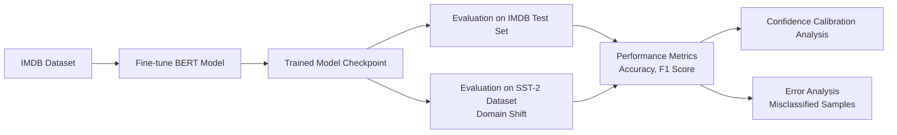
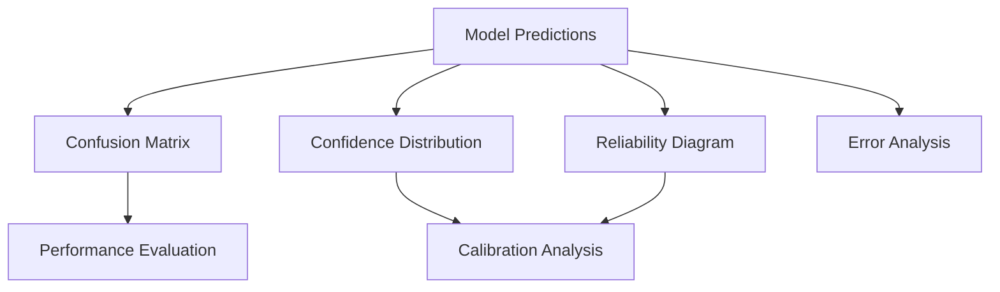
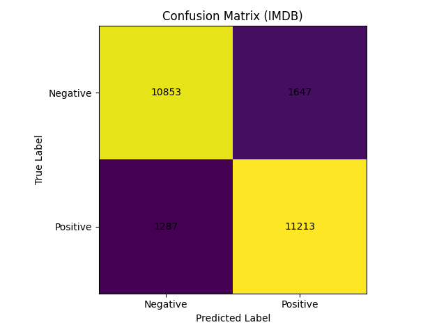
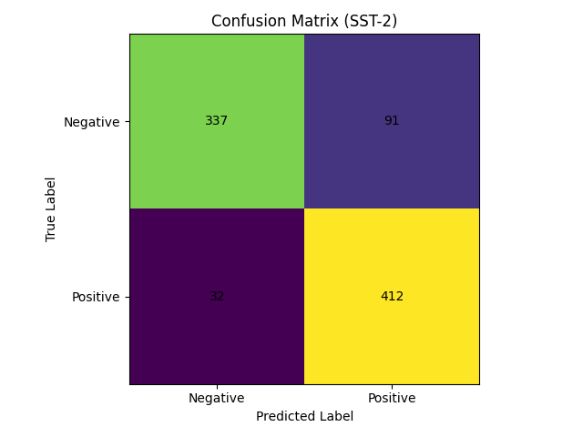
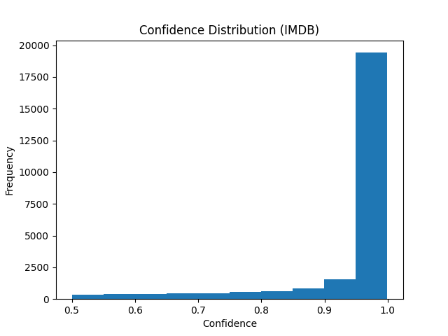
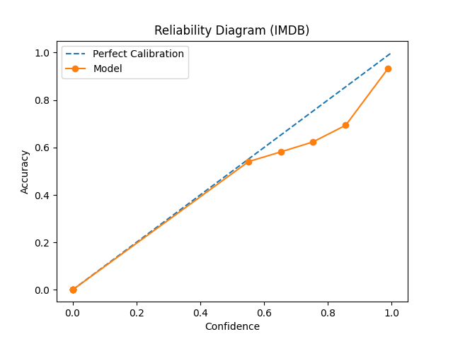
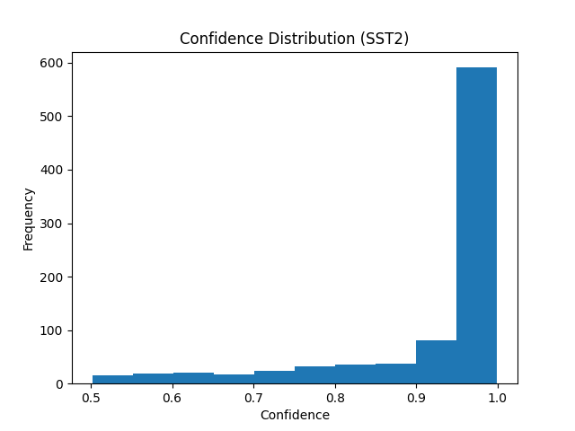
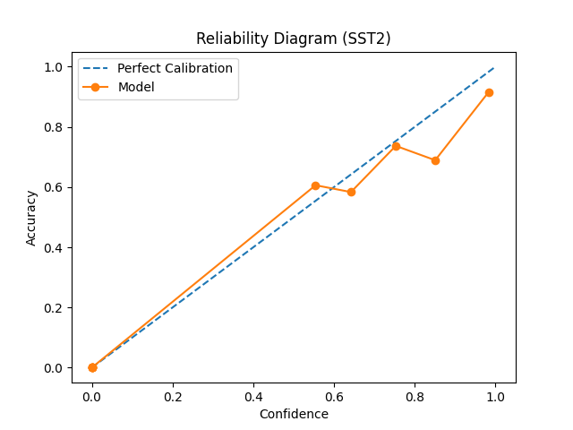

# Transformer Reliability Analysis under Domain Shift

[]()
[]()
[]()
[]()
[]()

This project analyzes the **reliability of transformer-based NLP models under domain shift**.

A **BERT sentiment classifier** is trained on the **IMDB movie review dataset** and evaluated on both **IMDB** and **SST-2** datasets to analyze:

- cross-domain generalization
- confidence calibration
- prediction reliability
- model failure patterns

---

# Table of Contents

- Overview
- Research Objective
- Methodology
- Experimental Setup
- Results
- Calibration Analysis
- Error Analysis
- Repository Structure
- Installation
- Usage
- Future Work
- References

---

# Overview

Transformer models such as **BERT** achieve state-of-the-art results in many NLP tasks.  
However, when deployed in real-world applications, models often encounter **domain shift**, where the distribution of test data differs from the training dataset.

Understanding model behavior under such conditions is critical for building reliable machine learning systems.

---

# Research Objective

The goals of this project are:

- Evaluate transformer performance under domain shift
- Analyze prediction confidence and calibration
- Identify patterns in misclassified samples
- Understand robustness of pretrained language models

---

# Methodology

Model used:

```
bert-base-uncased
```

## Model Architecture

The sentiment classification system is built on top of the **BERT transformer architecture**.  
The contextual embedding of the `[CLS]` token is used as the representation for classification.



Training objective: Cross-entropy loss for binary sentiment classification.

---

# Experimental Setup

## Experiment Workflow

The experimental pipeline evaluates the robustness of transformer models under **domain shift conditions**.



## Datasets

Two datasets were used.

### IMDB
- 50,000 movie reviews
- Balanced sentiment classes
- Long-form review text

### SST-2
- Stanford Sentiment Treebank
- Short movie review sentences
- Different linguistic distribution

Training domain: **IMDB**

Evaluation domains:
- IMDB (in-domain)
- SST-2 (domain shift)

---

# Training Configuration

| Parameter | Value |
|------|------|
Model | BERT-base-uncased |
Epochs | 3 |
Batch Size | 16 |
Learning Rate | 2e-5 |
Optimizer | AdamW |
Max Sequence Length | 128 |

---
## Evaluation Pipeline



# Results

## Classification Performance

| Dataset | Accuracy | F1 Score |
|------|------|------|
IMDB | **0.8826** | **0.8843** |
SST-2 | **0.8589** | **0.8701** |

Observation: Model performance decreases slightly under domain shift.

---

# Confusion Matrix

## IMDB



## SST-2



---

# Confidence Calibration Analysis

## IMDB Confidence Distribution



## IMDB Reliability Diagram



## SST-2 Confidence Distribution



## SST-2 Reliability Diagram



---

# Error Analysis

Misclassified examples were analyzed to identify common failure patterns.

Typical errors include:
- Short sentences with limited context
- Mixed sentiment statements
- Sarcastic expressions

Example:  
"The acting was great but the story was slow."

---

# Repository Structure

```
transformer-domain-shift
│
├── data
│   └── load_dataset.py
│
├── train
│   └── train_bert.py
│
├── eval
│   └── evaluate_model.py
│
├── experiments
│   ├── confidence_analysis.py
│   └── error_analysis.py
│
├── results
│
├── README.md
├── requirements.txt
└── environment.yml
```

---

# Installation

Clone the repository:

```
git clone https://github.com/YOUR_USERNAME/transformer-domain-shift.git
cd transformer-domain-shift
```

Create environment:

```
conda create -n bert_reliability python=3.10
conda activate bert_reliability
```

Install dependencies:

```
pip install -r requirements.txt
```

---

# Usage

### Train Model

```
python train/train_bert.py
```

### Evaluate Model

```
python eval/evaluate_model.py
```

### Confidence Analysis

```
python experiments/confidence_analysis.py
```

### Error Analysis

```
python experiments/error_analysis.py
```
## Running with Docker

Build the Docker image:

```
docker build -t transformer-domain-shift
```

Run the container:

```
docker run -it --gpus all transformer-domain-shift
```

This will create an isolated environment containing all dependencies required to reproduce the experiments.
---

# Future Work

Possible research extensions include:

- Domain adaptation techniques
- Calibration-aware training
- Testing larger models (RoBERTa, DeBERTa)
- Cross-domain transfer learning experiments

---

# References

Devlin et al., *BERT: Pre-training of Deep Bidirectional Transformers for Language Understanding*, NAACL 2019.

Guo et al., *On Calibration of Modern Neural Networks*, ICML 2017.

Pan & Yang, *A Survey on Transfer Learning*, IEEE TKDE 2010.

Hendrycks & Dietterich, *Benchmarking Neural Network Robustness*, ICLR 2019.

---

# Author

**Hema Sagar Koppusetti**  
B.Tech Artificial Intelligence and Machine Learning  
Lendi Institute of Engineering and Technology  

GitHub: https://github.com/HemaSagarKoppusetti  
LinkedIn: https://linkedin.com/in/hema-sagar-koppusetti
